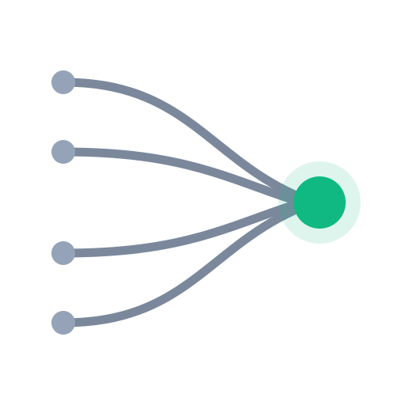

<p align="center">
  
</p>

<h1 align="center">referrer-capture-astro</h1>

<p align="center">
  <strong>Lead source attribution for Astro contact forms.</strong><br>
  Know which channel produced every lead, without risking the lead itself.
</p>

<p align="center">
  <a href="#quick-start">Quick start</a> ·
  <a href="docs/integration.md">Integration guide</a> ·
  <a href="docs/PLAN.md">Design</a> ·
  <a href="#faq">FAQ</a>
</p>

---

> **Status: planned, not built.** The design is settled and documented. The API below
> is the target, not something you can install today. Watch the repo for `v1.0.0`.

## What This Does

A visitor finds your site through a Google search, browses for a while, then fills out
your contact form. The notification email tells you their name and their message. It
does not tell you that search brought them in.

This package closes that gap. It records where a visitor came from when they arrive,
carries it through their session, and attaches it to the form submission, so your
notification reads:

```
--- Where this lead came from ---
Source:       google / organic  (organic-search)
Campaign:     spring-remodel
Landing page: /services/
First touch:  google / organic on Aug 1
```

## Why Not Just Use Analytics

Analytics platforms report source and medium in aggregate. They tell you organic
search drove 40% of last month's traffic. They cannot tell you that the inquiry
sitting in your inbox came from organic search.

That per-lead detail changes what you do next:

- **Judge ad spend against real leads,** not sessions.
- **Reply in context.** Someone who arrived from a comparison article needs a
  different first response than someone sent by a referral partner.
- **See channels analytics buries.** AI assistant traffic gets its own channel here
  instead of disappearing into generic referral.
- **Keep the record attached to the lead** as it moves into an inbox or CRM, rather
  than living in a dashboard nobody opens.

## Features

**Attribution that survives the whole visit**

- Captures campaign parameters, ad click IDs, and referrer on the landing page rather
  than the contact page, so someone who browses before converting keeps their source.
- Stores first touch and last non-direct touch, so a bookmarked return visit never
  erases the channel that earned the lead.
- Survives internal navigation, including moves between localized routes.

**Channels that reflect how traffic actually arrives**

- Paid and organic search, paid and organic social, email, referral, and direct.
- `ai-referral` as a first-class channel for ChatGPT, Perplexity, Claude, Gemini, and
  Copilot.
- Recognizes `gclid`, `gbraid`, `wbraid`, `msclkid`, `fbclid`, and `ttclid`.
- Domain and alias maps are plain data you can extend without forking.

**Built so it cannot cost you a lead**

- Attribution is additive. Blocked storage, a thrown error, or a malformed payload
  records `unknown` and the form still submits.
- Normalization runs once, server-side, so values cannot drift between two copies of
  the mapping logic.
- Payloads are capped, sanitized, and allow-listed before anything reaches an email.

**Portable across sites**

- Core has no Astro, hosting platform, or DOM imports.
- Works with static Astro, Cloudflare Pages Functions, and Astro Actions.
- No cookies. One `localStorage` record, so nothing rides along on asset requests.
- No build step, no runtime dependencies, MIT licensed.

## Quick Start

```bash
npm install github:garrettatx/referrer-capture-astro#v1.0.0
```

Capture on every page, from your base layout:

```astro
<script>
  import { capture } from 'referrer-capture-astro/client';
  capture();
</script>
```

Attach it to your submission:

```js
import { getAttribution } from 'referrer-capture-astro/client';

body: JSON.stringify({ name, email, message, attribution: getAttribution() })
```

Normalize and render it server-side:

```js
import { parseAttribution, formatForEmail } from 'referrer-capture-astro/server';

const attribution = parseAttribution(body.attribution);
emailBody += formatForEmail(attribution);
```

That is the whole integration. The [integration guide](docs/integration.md) covers
native form posts, Astro Actions, view transitions, consent gating, and testing.

## How It Works

Three stages, separated so a failure in capture cannot reach the submission.

| Stage | Where | What happens |
|---|---|---|
| Capture | Browser, on landing | Reads URL parameters and `document.referrer`, writes one versioned record to `localStorage` |
| Persist | Browser, across the session | Carries the record through internal navigation. Direct visits never overwrite a known source |
| Normalize | Server, on submit | Turns raw values into a canonical source, medium, and channel |

### Attribution Model

First touch and last non-direct touch are both stored. Last non-direct touch is
reported, because it credits the most recent channel that actually referred someone
while ignoring direct returns.

Campaign tags and referrers follow the same rule. Running different models on
different signals makes the answer depend on which touch happened to carry a tag, and
the data stops meaning anything.

## Compatibility

| Setup | Supported |
|---|---|
| Static Astro, no adapter | Yes |
| Cloudflare Pages Functions | Yes, via the Pages Function adapter |
| Astro Actions, SSR or hybrid | Yes, via the Actions adapter |
| Native form posts | Yes, via `mountHiddenFields()` |
| View transitions (`ClientRouter`) | Yes, re-run `capture()` on `astro:page-load` |

Static sites are the primary target. Astro Actions are supported and never required.

## FAQ

**Does this replace Google Analytics?**
No. Analytics measures traffic. This labels individual leads. Run both.

**What happens if a visitor blocks storage?**
The source records as `unknown` and the form submits normally. Attribution never
gates a submission.

**Does it set cookies?**
No. One `localStorage` record, which keeps it off every asset request your site
serves.

**Do I need a cookie consent banner?**
That depends on your jurisdiction and your privacy policy. A `shouldCapture()` hook
gates capture behind whatever consent platform you already run. This package ships no
consent UI.

**Where does the data go?**
Into your form submission and your notification email. This package stores nothing.

**Will it slow my site down?**
Capture is a small inline script with no hydration and no network request. The core
has no runtime dependencies.

## Documentation

- **[Integration guide](docs/integration.md).** Step-by-step setup, configuration,
  testing, troubleshooting, and how to hand this to an AI assistant.
- **[Design and build plan](docs/PLAN.md).** Attribution model, data contract, channel
  taxonomy, QA matrix, and the reasoning behind each decision.

## Contributing

Classification and normalization are pure functions and carry the logic worth testing.
Start there.

```bash
npm install
npm test
```

Adding a domain to the search, social, or AI maps in `src/config/` is a useful,
low-risk first contribution.

## License

MIT. See [LICENSE](LICENSE).
